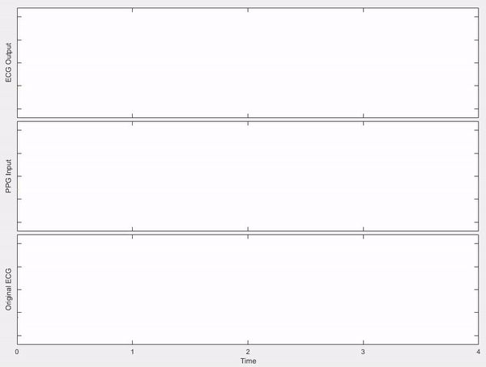

# PPG Signal Transformation and Heart Rate Detection

This project explores the transformation of Photoplethysmography (PPG) signals into Electrocardiography (ECG) signals using deep learning. The main objective is to bridge PPG-based monitoring with ECG-level insights, leveraging neural networks for real-time heart rate monitoring and cardiac health assessment. 

---

## Background and Motivation

PPG and ECG are both popular methods in physiological monitoring, often used for health diagnostics. However, PPG is non-invasive and commonly found in wearable devices, making it accessible for broader, real-time health applications. In contrast, ECG provides more detailed cardiac information but is traditionally harder to capture in day-to-day settings. This project combines the accessibility of PPG with the clinical insights of ECG, developing a model to translate PPG data into ECG-like waveforms and enhance non-invasive monitoring capabilities.

By transforming PPG data into ECG signals, this approach aims to provide a deeper level of health information from widely available wearable devices. This project is designed for real-time applications, highlighting the potential for integration into wearable technologies.

---

## Project Overview

This repository includes all necessary modules to:
- Connect and subscribe to real-time PPG data streams.
- Preprocess and filter PPG signals for deep learning applications.
- Use an attention-based neural network to generate ECG signals from PPG inputs.
- Visualize results and analyze heart rate trends.

The project's architecture is built around TensorFlow and includes advanced utility modules for filtering, normalization, and data stream processing.

---

## Repository Structure

The repository is structured as follows:

- **Module Definitions**: Custom layers and utility functions for the deep learning model.
- **Data Acquisition and Connection Scripts**: Code for establishing connections to a PPG data server, subscribing to live streams, and managing data.
- **Signal Filters**: Filtering modules that clean and normalize PPG data to improve model accuracy.
- **Attention-based Model**: A custom model architecture for PPG-to-ECG transformation with attention layers for capturing essential signal features.
- **Real-Time Processing Script**: Handles live data preprocessing and model inference for real-time applications.

---

## PPG Data Acquisition

### Data Collection Process

The data acquisition involves a real-time connection to a server that streams PPG data. Core steps include:

1. **Establishing the Connection**: Using a socket connection to receive data from a connected device.
2. **Subscribing to PPG Streams**: Configuring data streams to receive necessary signals like PPG and ECG for model training and real-time testing.
3. **Real-time Data Processing**: Capturing, filtering, and segmenting PPG signals for transformation.

### Data Preprocessing Pipeline

Raw PPG data is collected at a sampling frequency of 128 Hz. Before feeding it into the model, preprocessing steps are applied:

- **Resampling**: The PPG data is resized to a consistent shape.
- **Filtering**: Bandpass filters are applied to remove noise and isolate the signal's frequency components relevant to heart rate.
- **Normalization**: The signals are scaled to fit within a specific range, ensuring consistent model inputs.

---

## Model Architecture

### Generator Model with Attention Mechanism

The core model is a generator network that uses an attention mechanism to map PPG signals to ECG waveforms. The network includes the following layers:

1. **Downsampling Layers**: Extracts low-frequency information from PPG signals.
2. **Attention-based Skip Connections**: Enhances feature extraction by focusing on important signal regions.
3. **Upsampling Layers**: Reconstructs the ECG-like waveform from processed PPG features.

### Key Components of the Model

- **Attention Mechanism**: Improves the model's focus on important parts of the signal, especially for feature-dense PPG data.
- **Batch and Instance Normalization**: Helps with training stability and performance.
- **Dropout Regularization**: Used to prevent overfitting, especially in deeper layers.

The model architecture enables real-time ECG signal generation from PPG inputs, making it suitable for wearable and mobile applications.

---

## Results and Visualization

The results demonstrate that the model successfully generates ECG-like signals from PPG data. 

## Getting Started
Requirements
TensorFlow >= 2.0
SciPy and OpenCV for signal processing
sklearn for normalization and scaling
biosppy for signal filtering

## Conclusion
This project demonstrates the feasibility of using deep learning for PPG-to-ECG transformation. By leveraging advanced signal processing and attention mechanisms, the model can translate PPG data into ECG-like waveforms with high fidelity. This approach offers a valuable tool for non-invasive cardiac monitoring, particularly in wearable and mobile health applications.

## Future Work
### Potential directions for expanding this project include:

Optimizing the model for low-power mobile devices.
Exploring multi-channel PPG data to improve ECG accuracy.
Integrating other physiological metrics for comprehensive health monitoring.
